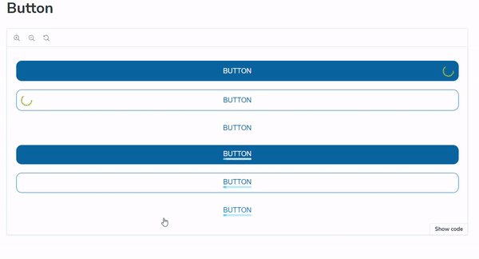

# React UI Kit

## Overview
This project is a comprehensive example for building UI Kit  with React, TypeScript, and Emotion. this kit integrates seamlessly with Storybook for component management, making it easy for developers to browse and test different states of each component.

  
  
  
  
  
  

To use this UI Kit, follow these steps:
<ol><li>Clone the repository.</li><li>Install dependencies using <code>yarn</code>.</li><li>Run the development server with <code>yarn storybook</code>.</li></ol>

## All components are built with:

- **React**: 
- **TypeScript**
- **Emotion**
- **Storybook**

## Components

This UI kit includes the following components with customization capabilities:

- **Accordion** 
- **Button** 
- **Card**
- **Checkbox**
- **Loading**
- **Tabs**
- **Tag**

## Connect with Me

Feel free to connect with me on LinkedIn!

